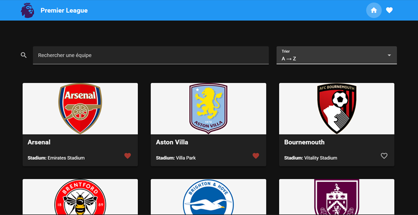
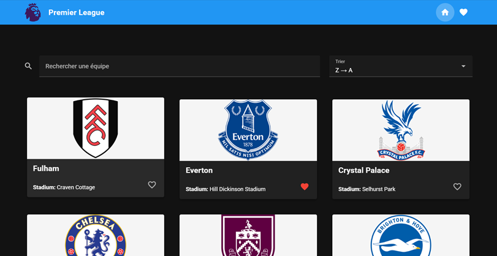
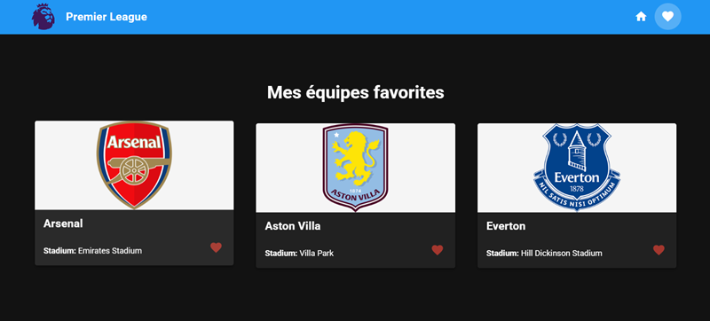
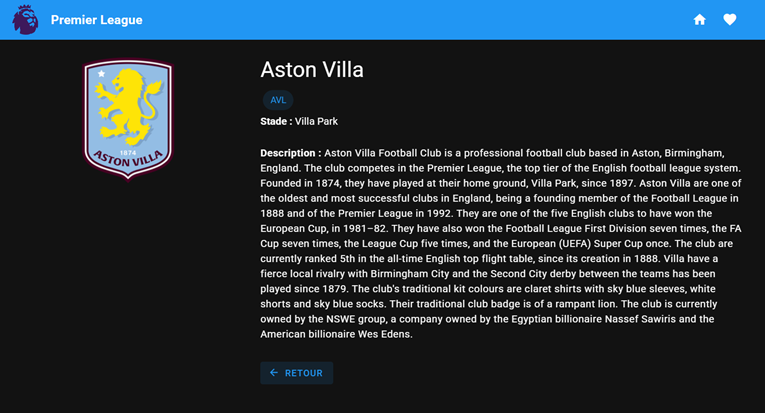

# 🌐 Mon Projet Vue.js & Vuetify

## 1. 🎨 Présentation du projet

### Concept
- API choisie et pourquoi: 
- J'ai choisi l'API TheSportsDB, car elle fournit toutes les informations nécessaires sur les équipes.
- 
- Le public cible: 
- Les fans de football ou utilisateurs souhaitant consulter des informations sur les équipes.
- 
- Objectifs de l’application:
- Afficher des équipes, rechercher par nom, trier alphabétiquement, consulter les détails, enregistrer ses favoris.

### Fonctionnalités principales
- Affichage d’une liste d’équipes (via API) et un fichier teams.json local est utilisé comme sauvegarde de secours (fallback).
- Recherche d'équipes par nom
- Tri alphabétique (A->Z, Z->A)
- Vue détail d'une équipe (logo,abréviation, description (souvent en anglais a cause de l'API), stade)
- Favoris avec persistance (localStorage)

### Aperçu visuel
_(Capture d’écran de l’application)_  

---

## 2. 📚 Parcours d'apprentissage

### Ressources utilisées
#### Documentation & tutos
- [Vue 3 Docs](https://vuejs.org/guide/introduction.html)
- [Vuetify Docs](https://vuetifyjs.com/en/components/all/)
- [Pinia Docs](https://pinia.vuejs.org/)
- [Public APIs List](https://github.com/public-apis/public-apis)
- [Support de cours](https://devjs.ch/)
- IA ?

#### Progression
- Semaine 1 : création du projet sur github + réalisation du sitemap du projet
- Semaine 2 : récupération des équipes via l'API
- Semaine 3 : Ajout des fonctionalités (tri, recherche et favoris)
- Semaine 4 : Création de la page détail et la persistance locale
- Semaine 5 : Réalisation de la documentation du projet
- Semaine 6 : Examen oral sur la présentation de notre projet

---

## 3. 🛠️ Outils et méthodologie

### Environnement de développement
- **IDE** : VS Code / WebStorm / Node.js ??????
- **Versioning** : Git + GitHub
- **Dépendances principales** : Vue 3, Vuetify 3, Pinia, Axios/Fetch
- **Gestion API Keys** : `.env` + `.env.example`

### Installation & Run
- Cloner le repo sur webstorm : https://github.com/divtec-cejef/m294-projet-vuetify-fan2Messi-Ryan-10
- Installer avec la commande suivante: npm install 
- Lancer le projet avec cette commande : npm run dev
- Variables d’environnement : copier `.env.example` → `.env` et compléter les clés nécessaires  

### Méthodologie
- Découpage en composants réutilisables ()
- Props & Emits clairs
- Store global avec Pinia
- Commits réguliers et explicites
- Tests manuels (UI, persistance, recherche, tri)

### Choix techniques
- API sélectionnée : TheSportsDB
- Justification du choix : complète et gratuite pour les données d'équipes
- Endpoints utilisés : search_all_teams.php?l=English_Premier_League
- Limites/quotas connus : nombre requête max = ~ 30, Limites pour les équipes = ~ 10

### Architecture (Descriptif + schéma simple + data-flow)
- `App.vue` : layout principal  
- `views/` : pages (Accueil, détail, favoris)  
- `componements/TeamCard.vue` : carte équipe
- `componements/TeamInfo.vue` : abréviation
- `componements/TeamStats.vue` : Statistiques 
- `stores/teamsStore.js` : gestion équipes + favoris

**Data-flow résumé :**  
Utilisateur clique / tape → composant utilise store → store met à jour state → composants réactifs s’actualisent → localStorage mis à jour pour les favoris
---

## 4. 🧪 Tests et validation

### Tests techniques
- ✅ Appels API fonctionnels  
- ✅ Persistance vérifiée après refresh (localStorage)  
- ✅ Navigation entre les vues OK  
- ✅ Tri et recherche dynamiques testés (A->Z, Z->A).

### Tests d’UX
- Navigation intuitive  
- Boutons favoris visibles et interactifs
- Recherche/filtre/tri faciles à comprendre  
- Feedback utilisateur (loading, erreurs, vide)

### Tests d’accessibilité
- Contraste couleurs (Vuetify par défaut)  
- Labels et placeholders corrects  
- Navigation clavier possible  
- Focus visible  
- ...

### Tests d’erreurs & fallback
- API down → **mock fallback** affiché (fichier local ou données simulées)  
- Liste vide → message clair affiché  
- Recherche sans résultat → affichage “Aucun élément trouvé”  
- Données incomplètes (ex: pas de description FR) → fallback vers EN ou message par défaut.
- image manquante → logo de remplacement affiché.
---

## 5. 🤖 Usage d’intelligence artificielle

**⚠️ TRANSPARENCE OBLIGATOIRE** : Si vous utilisez une IA, vous DEVEZ :

### IA utilisée
- **Nom** : ChatGPT  
- **Version** : GPT-4 
- **Contexte** : Aide ponctuelle pour débugger, Générer du code pour le style ou encore pour les commentaires du code  

### Utilisation détaillée
**Domaines d'aide :**
- Aide au code général : 25%
- Génération de snippets Vue/Vuetify : 35%  
- Aide à la structuration du projet : 15%
- Debugging : 15%  
- Recherche d’idées : 0%  

**Compréhension et adaptation**
- Le code généré par l'IA m'a servi de structure que j'ai ensuite compris et adapté chaque partie pour l'intégrer dans mon projet. 
- J'ai souvent simplifié le code proposé pour qu'il soit plus clair afin que je puisse le comprendre et le réutiliser.
- Je n'ai pas fait un projet dans la complexité mais un projet que je pouvais comprendre et réexpliquer.

### Parties codées manuellement
- Composants principaux : 70% personnel  
- Store & persistance : 90% personnel  
- Routing & navigation : 90% personnel  
- Tests & validation : 100% personnel  

### Apprentissage personnel
- J’ai appris à utiliser Vue 3, Pinia et Vuetify de manière concrète.
- J’ai aussi appris à analyser et corriger du code généré automatiquement, ce qui m’a beaucoup fait progresser.
- Cette expérience m’a montré comment garder le contrôle sur un projet tout en utilisant l’IA comme un assistant technique et non comme une béquille. 

---

## 6. 🎯 Bilan personnel

### Ce que j’ai appris
- Utiliser une API externe dans mon projet
- les composants UI avec vuetify
- Le router dynamique et la navigation
- Combiner les fonctionalités (tri + recherche + favoris)

### Difficultés rencontrées
- Problème de persistance de mes favoris après un refresh. 
- Solution : https://devjs.ch/exercices/pokedex-vuetify/e12.html
- Ajouter mon API externe dans le projet. 
- Solution: https://padlet.com/thomastirole/m294-r-aliser-le-front-end-d-une-application-web-interactive-c4zbr5flj1x6gq3e/wish/0BA3ZpG4302zQnPb
- Utiliser un JSON pour stocker mes données API et les implémenter dans mon projet.
- Solution: https://padlet.com/thomastirole/m294-r-aliser-le-front-end-d-une-application-web-interactive-c4zbr5flj1x6gq3e/wish/Ae2RavGE0OkbQnz4
- Créer un lien vers ma page détail.
- Solution: https://devjs.ch/exercices/pokedex-vuetify/e13.html

### Réussites et fiertés
- Application fonctionnelle avec tri, recherche, favoris, page détail
- Utilisation de composant réutilisable
- j'ai réussi à implémenter mon API avec un JSON au cas ou l'API aurait un problème.

### Améliorations possibles
- Ajouter des filtres supplémentaires (classement, meilleurs buteurs de chaques équipes)
- Traduction des description qui sont uniquement en anglais 
- Payer pour avoir plus de données d'API et encore plus augmenté les informations du site
---

## 7. 📚 Références & Sources
- Documentation de l’API : [TheSportsDB](https://www.thesportsdb.com/)  
- Tutos clés utilisés : [Exercice pokedex] (https://devjs.ch/exercices/pokedex-vuetify/)
- Usage de l’IA : voir section ci-dessus  
- Autres ressources utiles : 
- [Support de cours] (https://devjs.ch/)
- [Support pour vuejs] (https://fr.vuejs.org/)
- [vidéo du cours] (https://padlet.com/thomastirole/m294-r-aliser-le-front-end-d-une-application-web-interactive-c4zbr5flj1x6gq3e/wish/0BA3ZpG4302zQnPb)
- [vidéo du cours] (https://padlet.com/thomastirole/m294-r-aliser-le-front-end-d-une-application-web-interactive-c4zbr5flj1x6gq3e/wish/Ae2RavGE0OkbQnz4)